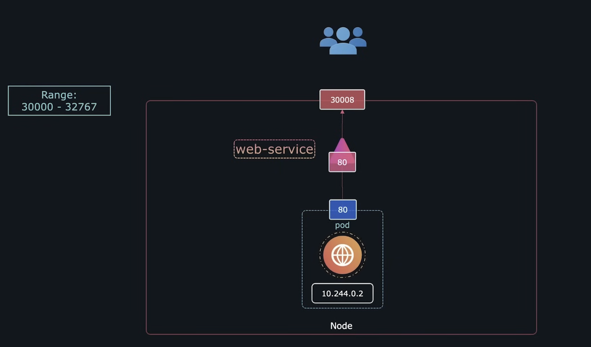

# Kubernetes Notes


## K8S Basics

Docker is a container creation platform, while Kubernetes is a container orchestration platform.

Kubernetes solves four key challenges that Docker alone struggles with:
1. **Single Host Limitation**
2. **Auto-Scaling**
3. **Auto-Healing**
4. **Enterprise Support**

   ---


---


## Kubernetes Architecture


---
### Worker Nodes / Data Plane
These nodes are responsible for running applications and handling workloads. The key components are:

1. **Container Runtime** – Like Docker Engine, it runs the actual containers. Kubernetes supports multiple runtimes like Docker, containerd, and CRI-O.
2. **PODs** – The smallest deployable unit in Kubernetes. Each POD can contain one or more containers that share the same storage and network.
3. **Kubelet** – A critical component that ensures the Pods are running and healthy. It continuously communicates with the Control Plane to report the node’s status.
4. **Kube-Proxy** – Unlike Docker’s bridge networking, Kube-Proxy manages network communication, assigns IP addresses, and ensures proper inter-Pod connectivity.

---

### Master Node / Control Plane
This is the brain of the Kubernetes cluster, responsible for managing the Worker Nodes. The key components are:

1. **API Server** – The heart of Kubernetes. It handles all requests from users and internal components, deciding where and when new Pods should be created.
2. **Scheduler** – Assigns new workloads (Pods) to Worker Nodes based on available resources and constraints.
3. **ETCD** – The database of Kubernetes. It stores cluster state and configurations in a key-value format, acting like a backup (similar to terraform.tfstate.backup).
4. **Controller Manager** – Ensures the cluster is always in the desired state. It monitors if Pods are running as expected and takes action when needed (e.g., auto-scaling).
5. **Cloud Controller Manager (CCM)** – Allows cloud providers to integrate their own services (e.g., AWS EKS, GCP GKE, Azure AKS) with Kubernetes.

   ---


---

## Common Kubernetes Commands

### Check Kubernetes Version
Check the client and server version of Kubernetes.
```bash
kubectl version
```

### Get Help
List all available Kubernetes commands.
```bash
kubectl --help
```

### List All Nodes
Outputs the Name, Status, Roles, Age, and Version of all nodes.
```bash
kubectl get nodes
```

### List Nodes with Additional Details
Displays extra information such as internal port, external port, OS image, kernel version, etc.
```bash
kubectl get nodes -o wide
```

### Create a Pod Imperatively
Creates a pod named `nginx` using the nginx image from Docker Hub.
```bash
kubectl run nginx --image=nginx
```

### List All Pods
Displays all available pods with details.
```bash
kubectl get pods
```

   ---


---

## Kubernetes Object Fields

### 1. `apiVersion`
Specifies the API version to be used for the Kubernetes object.
- **Pod:** `v1`
- **Service:** `v1`
- **ReplicaSet:** `apps/v1`
- **Deployment:** `apps/v1`

```yaml
apiVersion: v1  # Correct API version for Pod
```

### 2. `kind`
Defines the type of Kubernetes object to be created. It is case-sensitive.
- Example values: `Pod`, `Service`, `ReplicaSet`, `Deployment`

```yaml
kind: Pod  # Specifies the type of object
```

### 3. `metadata`
Provides metadata about the object, such as its name and labels.

```yaml
metadata:
  name: myapp-pod  # Name of the pod
  labels:
    app: myapp  # Labels for the pod
```

### 4. `spec`
Specifies the desired state of the object, such as container details.

```yaml
spec:
  containers:
    - name: nginx-container
      image: nginx
```

## POD

A Pod in Kubernetes is the `smallest deployable unit` that represents a single instance of a running process. It can contain one or more containers that share `storage, network, and a specification` for how they should run. Pods are managed by controllers like Deployments or StatefulSets for scaling and lifecycle management.


### Pod Definition (`pod-definition.yaml`)
```yaml
apiVersion: v1  # Correct API version for Pod
kind: Pod  # Specifies the type of object
metadata:
  name: myapp-pod  # Name of the pod
  labels:
    app: myapp  # Labels for the pod
spec:
  containers:
    - name: nginx-container
      image: nginx
```

---

### Commands for Managing Pods

#### Create a Pod from YAML
Creates a pod using the provided YAML configuration.
```bash
kubectl create -f pod-definition.yaml
```

#### Apply Changes to a Pod
Creates or updates a pod with the provided YAML definition.
```bash
kubectl apply -f pod-definition.yaml
```

#### List All Pods
Displays all available pods with details.
```bash
kubectl get pods
```

#### Describe a Pod
Provides detailed information about a specific pod, including its name, namespace, container image, state, conditions, and events.
```bash
kubectl describe pod myapp-pod
```

---

### Difference Between `kubectl create` and `kubectl apply`

| Command | Description |
|---------|-------------|
| `kubectl create -f pod.yaml` | Creates the resource defined in `pod.yaml`. Fails if the resource already exists. Best for one-time creation. |
| `kubectl apply -f pod.yaml` | Creates or updates the resource declaratively. If the resource exists, only changes are applied. Preferred for managing configurations over time. |


---

### Deletion Process

#### Delete a Pod Using a YAML Definition
```bash
kubectl delete -f pod.yaml
```

#### Delete a Pod with Minimal Delay
```bash
kubectl delete pod foo --now
```

#### Force Delete a Pod on a Dead Node
```bash
kubectl delete pod foo --force
```

#### Delete All Pods
```bash
kubectl delete pods --all
```

   ---


---

## REPLICASET

An application is running on a pod, and if the application crashes and pods go down, users will lose access. To prevent this, we need **ReplicaSet**. ReplicaSet `creates, manages, and monitors pods`. If any pods go down, ReplicaSet brings them back, ensuring the `desired and current state` always match. Kube-Scheduler assigns which pod will be created in which node, but ReplicaSet can create pods dynamically in any cluster or node to manage load.


### ReplicaSet Definition (`replicaset-definition.yaml`)

```yaml
apiVersion: apps/v1
kind: ReplicaSet
metadata: 
  name: myapp-replicaset
  labels:
    app: myapp
    type: front-end
spec: 
  template:
    metadata: 
      name: myapp-pod
      labels:
        app: myapp
        type: front-end
    spec:
      containers:
        - name: nginx-container
          image: nginx
  replicas: 3
  selector:
    matchLabels:
      type: front-end
```

---

### Commands

#### Create a ReplicaSet
```bash
kubectl create -f replicaset-definition.yaml
```

#### Check the ReplicaSet
```bash
kubectl get replicaset
```

#### Delete the ReplicaSet
```bash
kubectl delete replicaset myapp-replicaset
```

Now, inside `spec` of ReplicaSet, we see the entire pod definition. This is because we are creating a ReplicaSet for pods. `replicas` stands for `the desired number of pods`. It can be any number depending on requirements. `selector` and `matchLabels` help ReplicaSet `monitor and manage specific pods`.

---

### Scaling in ReplicaSet

#### Scenario: Increase Replicas from 3 to 6
We have two ways to do this:

1. **Using Scale Command** _(Not Recommended)_
   ```bash
   kubectl scale --replicas=6 -f replicaset-definition.yaml
   ```
   This increases the replicas to 6, but the main config file still shows 3. This is not the best approach.

2. **Updating the YAML File and Replacing ReplicaSet** _(Correct Approach)_
   - First, update `replicas` in `replicaset-definition.yaml` to `6`.

```yaml
apiVersion: apps/v1
kind: ReplicaSet
metadata: 
  name: myapp-replicaset
  labels:
    app: myapp
    type: front-end
spec: 
  template:
    metadata: 
      name: myapp-pod
      labels:
        app: myapp
        type: front-end
    spec:
      containers:
        - name: nginx-container
          image: nginx
  replicas: 6
  selector:
    matchLabels:
      type: front-end
```

   - Then, run the following command:
   ```bash
   kubectl replace -f replicaset-definition.yaml
   ```

---

   ### Fixing CrashLoopBackOff for BusyBox
If a busybox container exits immediately, modify the YAML to keep it running:
```yaml
apiVersion: apps/v1
kind: ReplicaSet
metadata:
  name: new-replica-set
  labels:
    tier: frontend
spec:
  replicas: 4
  selector:
    matchLabels:
      tier: frontend
  template:
    metadata:
      labels:
        tier: frontend
    spec:
      containers:
      - image: busybox
        name: busybox
        command: ["sh", "-c", "while true; do echo Hello, Kubernetes!; sleep 10; done"]
```
### Why This Works?
- `sh -c` starts a shell.
- `while true; do echo Hello, Kubernetes!; sleep 10; done` runs an infinite loop to prevent the container from exiting.


   ---


---

## DEPLOYMENT

Till now, we understand how we can deploy applications using Kubernetes Pods and ReplicaSets. However, in a production environment, these methods are not efficient. If we need to update the application to a newer version or apply changes, we would have to update each pod one by one manually. If the update fails, we must roll back to the previous version. Additionally, we might want to pause the application before starting an update rollout and resume it after the update is complete. The **Kubernetes Deployment** object helps manage these tasks efficiently.

A **Deployment** provides a higher level in Hierarchy than ReplicaSet and allows us to:
- Perform **rolling updates** and **rollbacks** in case of failure.
- **Pause and resume** application in between update rolling.
- Scale applications easily.


### Deployment Definition (`deployment-definition.yaml`)

```yaml
apiVersion: apps/v1
kind: Deployment
metadata: 
  name: myapp-deployment
  labels:
    app: myapp
    type: front-end
spec: 
  replicas: 3
  selector:
    matchLabels:
      type: front-end
  template:
    metadata: 
      labels:
        app: myapp
        type: front-end
    spec:
      containers:
        - name: nginx-container
          image: nginx
```

---

### Commands

#### Create a Deployment
```bash
kubectl create -f deployment-definition.yaml
```

#### Check the Deployment
```bash
kubectl get deployments
```

#### Get Detailed Information About a Deployment
```bash
kubectl describe deployment myapp-deployment
```

#### Delete the Deployment
```bash
kubectl delete deployment myapp-deployment
```

Using the `kubectl get replicaset` command, we can verify that a ReplicaSet named `myapp-deployment` has been created. Since ReplicaSets manage and creates pods, we can use the `kubectl get pods` command to check the pods associated with this ReplicaSet created by the `Deployment` object.


#### View All Created Objects by Kubernetes
```bash
kubectl get all
```
---

  ### Updating a Deployment

To update the image in a deployment, we can use two approaches:

#### 1. Imperative Approach (Command-Based)
Command will be like:
```bash
kubectl set image deployment/deployment-name \ container-name=new-image
```

For thw above exapmle file, the command is 
```bash
kubectl set image deployment/myapp-deployment \ nginx-conatiner=nginx:1.9.1
```

#### 1. Declarative Approach (YAML-Based)
Modify `deployment-definition.yaml` as follows:
```yaml
apiVersion: apps/v1
kind: Deployment
metadata: 
  name: myapp-deployment
  labels:
    app: myapp
    type: front-end
spec: 
  replicas: 3
  selector:
    matchLabels:
      type: front-end
  template:
    metadata: 
      labels:
        app: myapp
        type: front-end
    spec:
      containers:
        - name: nginx-container
          image: nginx:1.9.1
```
Then apply the updated file:

```bash
kubectl apply -f deployment-definition.yaml
```
This ensures a smooth update rollout while maintaining availability.

---
 ### Scaling a Deployment
 #### Scale Up to 5 Replicas
```bash
kubectl scale deployment myapp-deployment --replicas=5
```

#### Scale Down to 2 Replicas
```bash
kubectl scale deployment myapp-deployment --replicas=2
```

---
### Rolling Back a Deployment
#### If a new update fails and we need to revert to the previous working version:
```bash
kubectl rollout undo deployment myapp-deployment
```
#### Check the Rollout History
```bash
kubectl rollout history deployment myapp-deployment
```
#### Pause the Deployment Update
```bash
kubectl rollout pause deployment myapp-deployment
```
#### Resume the Deployment Update
```bash
kubectl rollout resume deployment myapp-deployment
```

   ---

---

## SERVICE

In a Kubernetes cluster, each Pod is assigned a unique IP address, enabling communication between them. Suppose we have deployed two Pods:

1. A **Web Server Pod**  
2. A **Redis Server Pod**  

Initially, the Web Server Pod can communicate with the Redis Server Pod using its assigned IP address. However, if the Redis Server Pod goes down and a new Pod is created to replace it, Kubernetes will assign it a new IP address. This change will cause the Web Server Pod’s connection to break since it was using the previous IP address, making the code unreliable.

To solve this issue, Kubernetes provides **Services**, which create a stable and consistent endpoint for communication. By exposing the Redis Server Pod through a `Service`, the Web Server Pod can always connect to it using the service name instead of the Pod IP, ensuring seamless communication even if the Redis Pod is recreated with a different IP.


In the above example, we create a `redis-db` Service to facilitate communication between the Web Server Pod and the Redis Server Pod. By using this service, the Web Server can reliably connect to Redis without worrying about Pod IP changes.


Similarly, to expose the Web Server to external users, we can create another Service, such as `web-service`. This allows users outside the cluster to access the Web Server. Thus, a `Service` can provide connectivity both within the cluster among its components and externally to end users.


---

### Different types of Services


### ClusterIP

A **ClusterIP** Service is used for internal communication within a Kubernetes cluster and is not exposed outside of it. It enables different services to connect with each other. 

In the above example, the `redis-db` Service, which facilitates communication between the Web Server Pod and the Redis Server Pod, is an example of a `ClusterIP` Service. 

Using `labels` and `selectors`, we can create a `ReplicaSet` of Pods and use these labels to connect them efficiently within the cluster.


#### ClusterIP Service Definition (`service-definition.yaml`)

```yaml
apiVersion: v1
kind: Service
metadata:
  name: redis-db
spec:
  type: ClusterIP
  ports:
    - targetPort: 6379
      port: 6379
  selector:
    app: myapp
    name: redis-pod
```

---

### Commands

#### Create a Service
```bash
kubectl create -f service-definition.yaml
```

#### Check the Deployment
```bash
kubectl get services
```

#### Delete a Service
```bash
kubectl delete service redis-db
```

---

### Port vs. TargetPort

- **Port (Service Port):**
  - This is the port that the Kubernetes Service exposes internally within the cluster.
  - Other pods in the cluster use this port to communicate with the service.

- **TargetPort (Pod Port):**
  - This is the port on which the application inside the pod is actually listening.
  - The service forwards traffic received on the **Port** to this **TargetPort** on the selected pod(s).
  - If not specified, it defaults to the same value as **Port**.


---


### NodePort

A **NodePort** Service exposes an application on a static port on each node’s IP, making it accessible to external users. In the above example, the `web-service` uses **NodePort**, allowing external users to access the web server through a specific port on any node in the cluster.

- **NodePort Range:** Kubernetes assigns NodePort values from the default range `30000-32767`. The service is accessible via `NodeIP:NodePort` from outside the cluster.




#### NodePort Service Definition (`service-definition.yaml`)

```yaml
apiVersion: v1
kind: Service
metadata:
  name: web-service
spec:
  type: NodePort
  ports:
    - targetPort: 6379
      port: 6379
      nodePort: 30008
  selector:
    app: myapp
    name: redis-pod
```

---

### Commands

#### Create a Service
```bash
kubectl create -f service-definition.yaml
```

#### Check the Deployment
```bash
kubectl get services
```

#### Accessing the Web-Service
```bash
curl http://192.168.1.2:30008
```

---

In a real-world scenario, there may be multiple Pods running the same application for load balancing, either on a single node or across multiple nodes. To efficiently manage traffic, we can create a single Service that selects all relevant Pods using selectors and exposes a NodePort to external users, ensuring seamless access and load distribution.


---


### Important Notes on Service Ports

1. **Port is a mandatory field** for every Service, whether it is of type **ClusterIP** or **NodePort**.
2. **If `targetPort` is not specified**, Kubernetes automatically sets it to the same value as `port`.
3. **For a NodePort Service, if no port is specified,** Kubernetes automatically assigns a free port from the range `30000-32767`.

---

---


## Conclusion

In this documentation, we have covered the fundamental concepts of Kubernetes, including Pods, ReplicaSets, Deployments, and Services, along with essential commands to manage them efficiently. We explored how Kubernetes orchestrates containerized applications, ensures high availability, and enables seamless scaling.

By understanding Pods as the smallest deployable units, ReplicaSets for maintaining desired pod counts, Deployments for declarative updates, and Services for stable networking, you now have a strong foundation in Kubernetes.

With these concepts and commands, you can deploy, manage, and scale applications effectively in a Kubernetes environment. Keep exploring and experimenting to deepen your understanding of Kubernetes operations! 🚀
